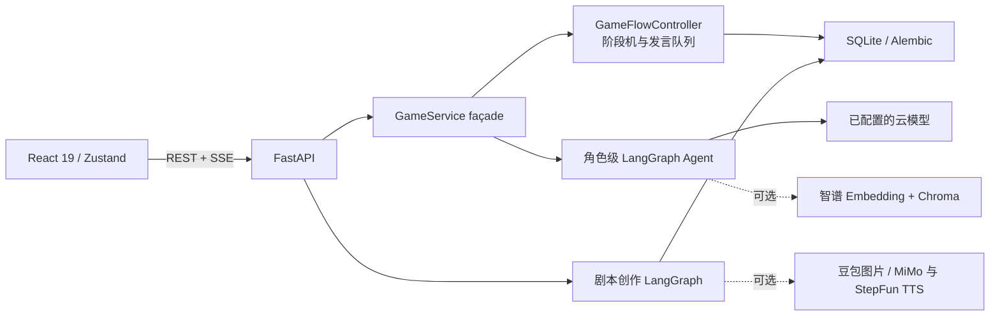

# 独醒 AI 剧本杀（Sober Alone）

> **English summary:** A local-first, single-user, single-process reference implementation for playing and authoring AI-assisted murder-mystery games. The bundled `雾港回声` sample is text-only; a DeepSeek API key is sufficient for the main game and text-authoring paths. Optional RAG, image and TTS features are capability-gated.

独醒是一个比赛 Demo 治理而来的开源参考工程：真人玩家选择一个角色，与多个 AI 角色依次发言、分析线索、自由讨论并投票；也可以从一句创意生成新的纯文本剧本。

## 发布边界

- 版本：`0.1.0`。
- 运行定位：`local-first / single-user / single-process`。
- 后端示例命令只监听 `127.0.0.1`；没有认证、限流、多租户和多实例一致性，不应直接暴露到公网。
- 产品没有 Mock 模式；替身只存在于测试装配。
- 运行数据、数据库、向量、检查点和生成媒体均写入被忽略的 `backend/.local-data/`。
- `雾港回声` 是固定 ID 的 4 人、2 轮线索、约 20 分钟原创纯文本样例，无图片、音频和预计算向量。它标记为 AI 生成；公开发布前仍需由维护者完成人工逻辑审阅。

## 架构



推荐部署为同源：反向代理 `/api`、`/audio`、`/images` 到后端，其余路径到前端静态文件。开发服务器已经配置这些代理。

## 能力矩阵

| 能力 | 配置 | 缺少配置时的行为 |
|---|---|---|
| 主游戏与纯文本创作 | `DEEPSEEK_API_KEY` | 必需；无法创建 AI 对局或生成剧本 |
| 摘要 / 流式 TTS | `STEPFUN_API_KEY` | 摘要回退到主模型；流式 TTS 禁用 |
| 角色剧本 RAG | `ZHIPUAI_API_KEY` | 不注册 RAG 工具；仅向该角色注入其完整个人剧本 |
| 图片生成 | `DOUBAO_API_KEY` | 图片任务标记 `skipped` 并说明原因 |
| 静态 TTS | `MIMO_API_KEY` | 静态语音任务标记 `skipped` 并说明原因 |
| 千问角色模型 | `QWEN_API_KEY` | 不在前端模型列表展示 |

运行后可访问：

- `GET /healthz`：只检查应用与本地数据库，不调用外部服务。
- `GET /api/v1/system/capabilities`：列出模型和可选能力状态，不返回 Key。

## 15 分钟快速开始

要求：Python 3.13、Node.js 22、pnpm 10、[uv](https://docs.astral.sh/uv/)。

### 1. 初始化后端

```bash
cd backend
copy .env.example .env        # Windows
# cp .env.example .env        # macOS / Linux
```

只填写：

```dotenv
DEEPSEEK_API_KEY=你的_Key
```

然后执行：

```bash
uv sync --frozen
uv run python -m app.cli init
uv run uvicorn app.main:app --reload --host 127.0.0.1 --port 8000
```

`init` 会升级 Alembic、创建本地目录，并且仅在空库时导入 `雾港回声`；重复执行不会覆盖已有剧本。
启动 Uvicorn 前应看到 `Database ready.`。如果启动时提示数据库未初始化，或曾遇到
`no such table: scripts`，请先停止后端，在 `backend` 目录重新执行：

```bash
uv run python -m app.cli init
```

然后重新启动后端。`GET http://127.0.0.1:8000/healthz` 返回
`{"status":"ok","database":"ok"}` 后，才表示本地数据库已可用。

### 2. 启动前端

```bash
cd frontend
pnpm install --frozen-lockfile
pnpm dev --host 127.0.0.1
```

访问 `http://127.0.0.1:5173`，选择 `雾港回声` 和一个角色开始游戏。

### 3. 迁入旧私有数据库（可选）

先停止后端，再执行：

```bash
cd backend
uv run python -m app.cli adopt-legacy-db --path D:/absolute/path/game_data.db
```

命令会先验证五张业务表并在源文件旁创建时间戳备份，再登记并升级迁移；不会删除源数据库。

## 游戏与创作流程

```text
大厅 → 选角 → 自我介绍 → [线索分析 → 自由讨论] × N → 总结 → 投票 → 复盘
```

```text
创意 → 大纲 → 初稿 → AI 评审 → 终稿 → 游戏数据 → 安全检查 → 保存 → 可选资产
```

创作工作流保留人工审核、历史检查点和分叉。可选供应商缺失时资产任务显示 `skipped + reason`，不会伪装为成功。

运行时生成的剧本、图片和语音在 UI 中带有 AI 生成提示；图片请求保留供应商水印。请勿移除供应商要求的显式或隐式标识。

## 测试

后端普通测试禁止访问外部主机；真实 API 冒烟必须显式手动运行。

```bash
cd backend
uv sync --frozen
uv run ruff check app migrations tests scripts
uv run ruff format --check app migrations tests scripts
uv run python -m pytest -q

cd ../frontend
pnpm install --frozen-lockfile
pnpm lint
pnpm test
pnpm build
pnpm exec playwright install chromium
pnpm test:e2e

cd ..
uv run --project backend python scripts/check_public_tree.py
uv run --project backend python scripts/check_dependency_licenses.py
uv run --project backend python scripts/generate_sbom.py
```

付费 live 冒烟不会被 pytest 收集：

```bash
cd backend
uv run python -m scripts.live_api_smoke deepseek
uv run python -m scripts.live_api_smoke stepfun
```

## 数据流、费用和隐私

提示词、角色个人剧本、玩家发言或待生成资产可能被发送给你启用的第三方云服务。项目不会替你承担调用费用，也不保证供应商的数据保留、区域或合规策略。启用前请阅读 [第三方服务说明](docs/THIRD_PARTY_SERVICES.md)，不要输入无权处理的个人信息、商业秘密或受版权保护内容。

## 已知限制

- 所有运行时 registry/checkpointer 均为单进程内存状态；进程重启会通过数据库恢复游戏阶段游标，但不会提供分布式一致性。
- API 无认证和限流，服务端 Key 可被写接口消费；只能在受信任的本机环境运行。
- 没有 Docker、后台任务队列、Redis、多用户账号或生产部署模板。
- 媒体采用同源相对 URL；分域部署需要自行配置反向代理或修改 media base。
- 可选供应商的 live 验证范围见 [CHANGELOG](CHANGELOG.md)，不能把源码开源等同于第三方服务或生成内容可自由再分发。

## 发布资料

- [CHANGELOG](CHANGELOG.md)
- [ROADMAP](ROADMAP.md)
- [第三方通知](THIRD_PARTY_NOTICES.md)
- [品牌与 Logo 例外](TRADEMARKS.md)
- [SBOM 说明](docs/SBOM.md)

## License

源代码与明确标注的原创文本样例采用 [MIT License](LICENSE)。项目名称“独醒 / Sober Alone”和 Logo 不随 MIT 授权，详见 [TRADEMARKS.md](TRADEMARKS.md)。第三方云服务、依赖和用户生成内容受各自条款约束。
